# PantryPal

### CPSC 411A-02 – Team Project

**Team Members:**

* **Jose Manuel Gonzalez Alfaro** – CWID: 802229633
* **Hisham Panamthodi Kajahussain** – CWID: 885147090
* **Andrew Vu** – CWID: 884555095

---

## Overview

**PantryPal** is a multi-screen Android application built with **Jetpack Compose** that helps users track food items in their pantry, monitor expiration dates, and organize items by storage zones.

The app demonstrates mastery of Android concepts covered in class, including:

* Firebase Authentication (Email/Password)
* Persistent data storage with Firebase Firestore
* MVVM architecture with Repository pattern
* State-driven UI using Jetpack Compose
* Navigation with protected routes
* Real-time, user-scoped data

---

## Features

### Authentication

Implements Firebase Email/Password authentication with proper auth state management, protected routes, persistent login, input validation, loading states, and user-friendly error handling.

* Email & password sign up and login
* Password validation (minimum 6 characters)
* Email validation with clear error messages
* Loading indicators during authentication
* Persistent login across app restarts
* Secure sign out with navigation stack reset
* Password reset via email

### Dashboard

* Summary cards showing:

    * Items expiring today
    * Items expiring soon (within 3 days)
    * Total pantry items
* Real-time data pulled from Firestore
* One-tap navigation from dashboard cards to inventory

### Inventory Management

The application uses Firebase Firestore with full CRUD operations on two entities (Items and Storage Zones), with all data scoped per authenticated user and synchronized in real time.

* View all items belonging to the logged-in user
* Add new items with:

    * Name
    * Quantity
    * Expiration date (DatePicker)
    * Storage zone (user-defined storage locations, example: Pantry / Fridge / Freezer)
* Edit existing items
* Delete items
* Automatic inventory refresh after CRUD actions
* Search support (UI wired for filtering)

### Storage Zones

* Manage storage locations (user-defined storage locations, example: Pantry / Fridge / Freezer)
* Add, rename, and delete zones
* Validation to prevent deleting zones in use (if applicable)

### Profile

* Display logged-in user information
* Sign out functionality
* Protected navigation (no access to app screens when signed out)

---

## Screens

The application includes more than 8 fully functional screens implemented using Jetpack Compose and the Navigation component.

The application includes **8+ functional screens**, including:

* Login Screen
* Sign Up Screen
* Dashboard Screen
* Inventory List Screen
* Item Detail Screen
* Add Item Screen
* Edit Item Screen
* Storage Zones Screen
* Profile Screen

---

## Architecture & Technical Implementation

The application follows the MVVM architecture with a Repository pattern, ensuring clean separation of concerns, single sources of truth, and lifecycle-aware state management.

### Tech Stack

* **Language:** Kotlin
* **UI Framework:** Jetpack Compose (Material 3)
* **Authentication:** Firebase Authentication
* **Database:** Firebase Firestore
* **Architecture:** MVVM + Repository Pattern
* **Concurrency:** Kotlin Coroutines
* **State Management:** StateFlow

### Architecture Highlights

* Clear separation of concerns using MVVM
* UI composables contain no Firebase logic
* ViewModels manage state and business logic
* Repositories abstract Firebase access
* User-scoped Firestore paths ensure data isolation
* Centralized expiration date handling via `ItemExtensions.kt`

Firestore structure:

```
/users/{uid}/items/{itemId}
/users/{uid}/storageZones/{zoneId}
```

---

## App Structure

```
com.jose.pantrypal/
│
├── auth/
│   ├── AuthViewModel.kt
│   ├── AuthRepository.kt
│   ├── FirebaseAuthRepository.kt
│   └── AuthScreens.kt
│
├── dashboard/
│   ├── DashboardScreen.kt
│   ├── DashboardViewModel.kt
│   └── DashboardModels.kt
│
├── inventory/
│   ├── InventoryScreen.kt
│   ├── InventoryViewModel.kt
│   ├── AddItemScreen.kt
│   └── ItemDetailScreen.kt
│
├── storage/
│   ├── StorageScreen.kt
│   └── StorageViewModel.kt
│
├── items/
│   ├── Item.kt
│   ├── ItemRepository.kt
│   ├── FirestoreItemRepository.kt
│   └── ItemExtensions.kt
│
├── navigation/
│   ├── Routes.kt
│   └── PantryNavGraph.kt
│
├── profile/
│   └── ProfileScreen.kt
└── ui/
    └── theme/
        ├── Color.kt
        ├── Theme.kt
        └── Type.kt

```

---

## Team Contributions

* **Jose Manuel Gonzalez Alfaro**

    * Project setup and architecture
    * Firebase authentication (login, sign up, reset, sign out)
    * Navigation and protected routes
    * Dashboard implementation
    * Repository design and architectural cleanup

* **Hisham Panamthodi Kajahussain**

    * Firestore integration
    * Inventory data layer
    * Item CRUD (add, edit, delete)
    * Item detail screens and validation

* **Andrew Vu**

    * Storage zones management
    * Inventory UX enhancements
    * Search, filtering, and visual cues
    * UI polish and user experience improvements

---

## Screenshots

### Authentication

| Light Mode | Dark Mode |
|------------|-----------|
| 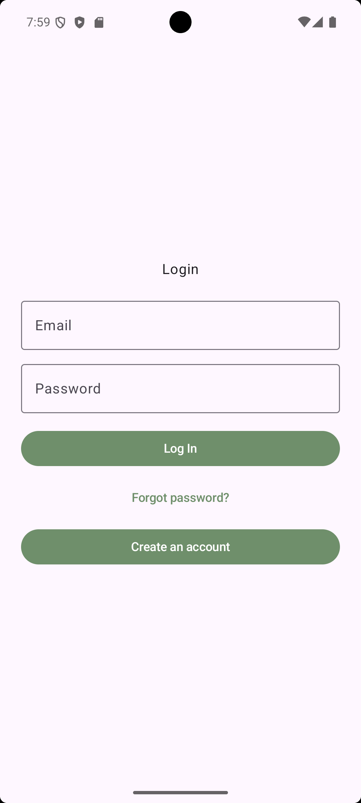 | 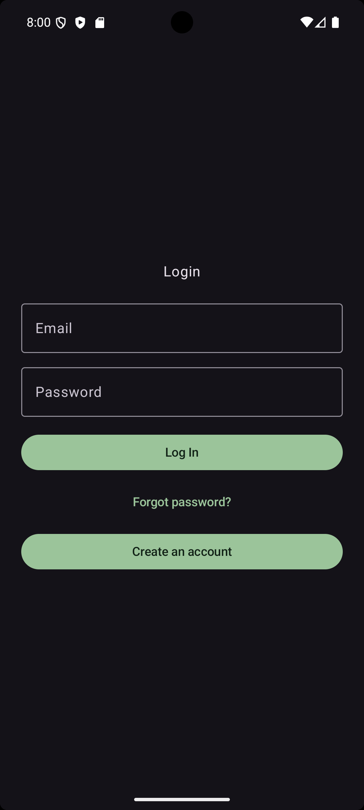 |

| Create Account (Light) | Create Account (Dark) |
|------------------------|-----------------------|
| 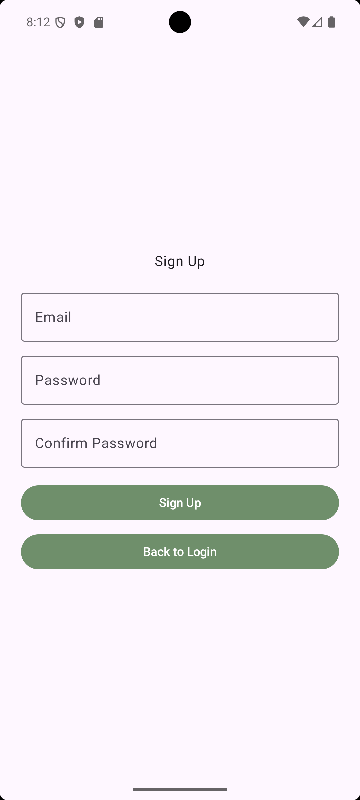 | 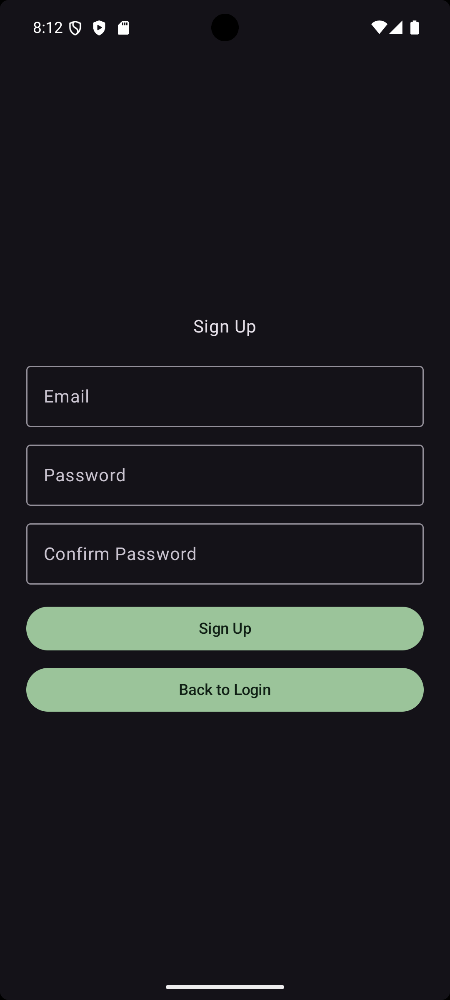 |

### Dashboard

| Light Mode | Dark Mode |
|------------|-----------|
| 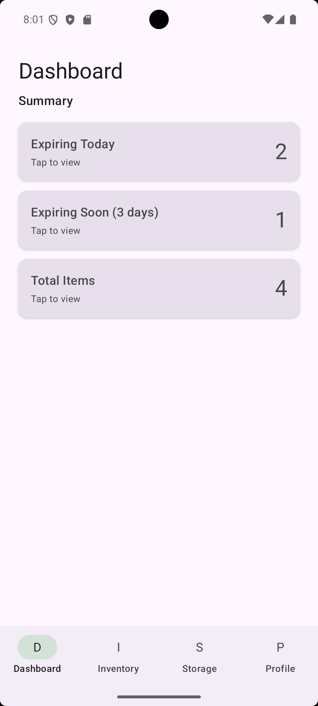 | 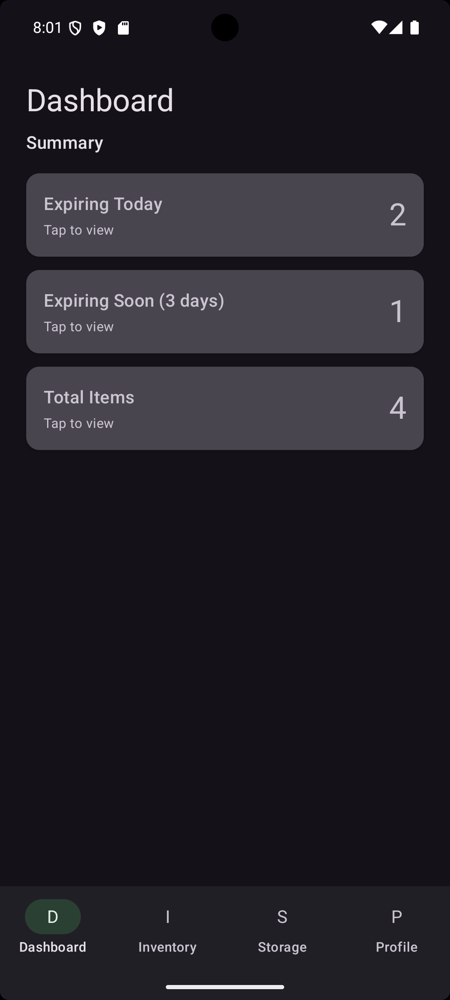 |

### Inventory

| Light Mode | Dark Mode |
|------------|-----------|
| 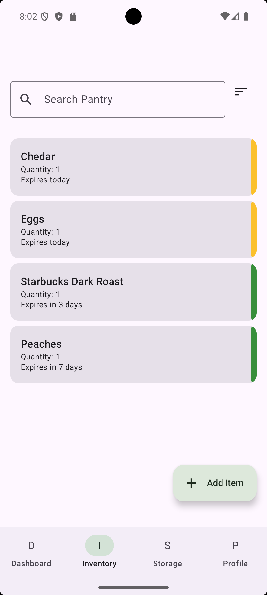 | 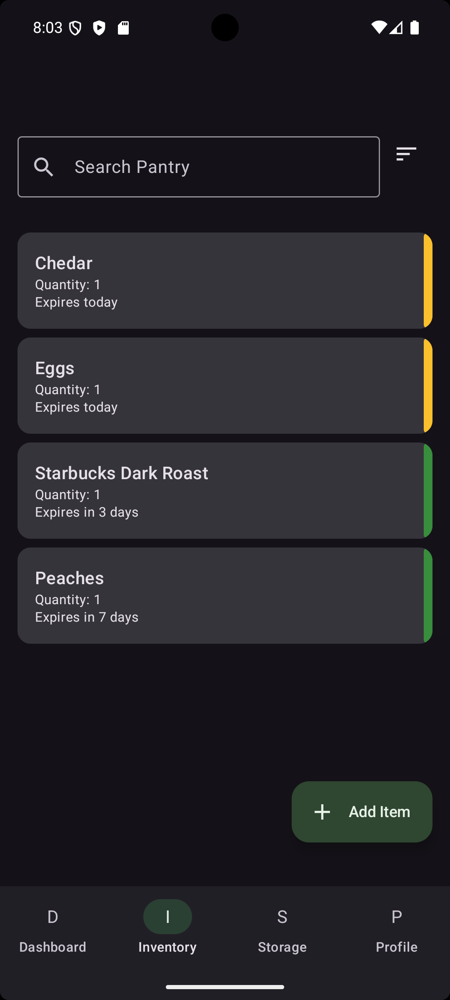 |

### Storage Zones

| Light Mode | Dark Mode |
|------------|-----------|
| 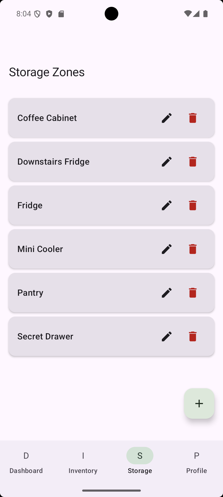 | 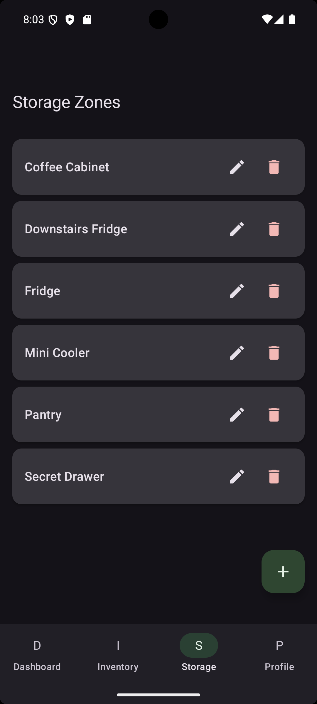 |

### Profile

| Light Mode | Dark Mode |
|------------|-----------|
| 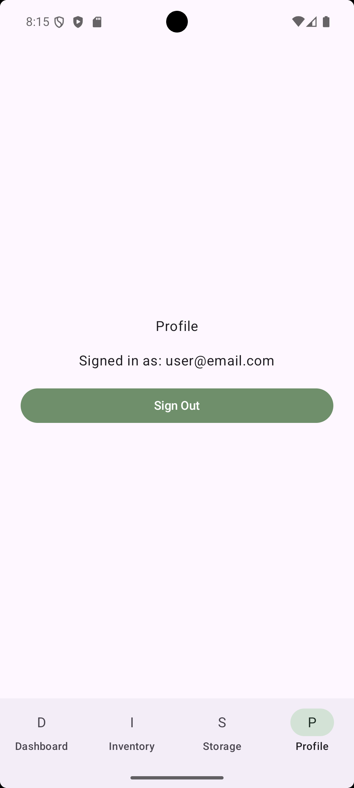 | 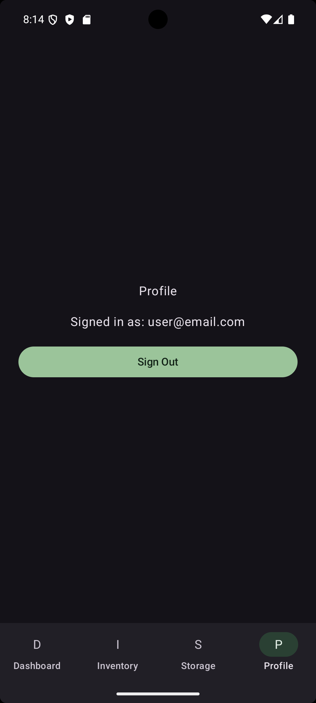 |

---

## How to Run

1. Clone the repository:

   ```bash
   git clone https://github.com/jmgonzalez06/PantryPal.git
   ```
2. Open the project in **Android Studio (Giraffe or newer)**.
3. Add your Firebase configuration file (`google-services.json`).
4. Build and run on an emulator or physical Android device (API 24+).

---

## Demo Video

**YouTube (Unlisted):**
https://youtu.be/uSneMkv7rHM

---

## License

This project was created for **CPSC 411A-02 – Mobile Device Application Programming for Android**
at **California State University, Fullerton**.

For educational purposes only.

---

